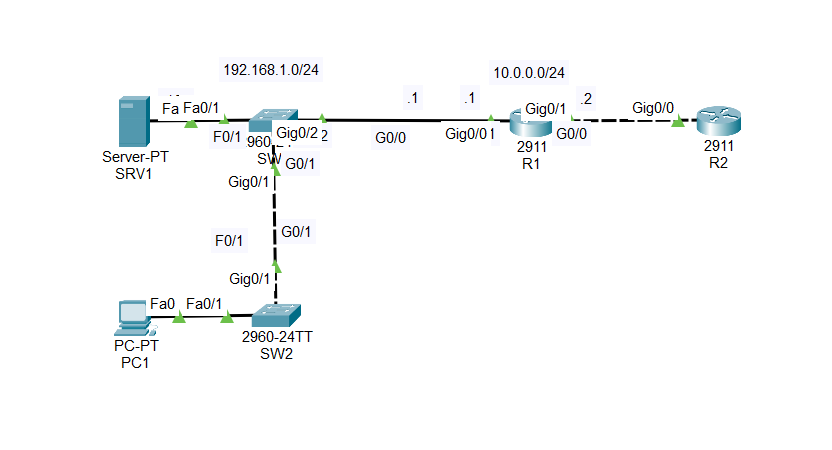
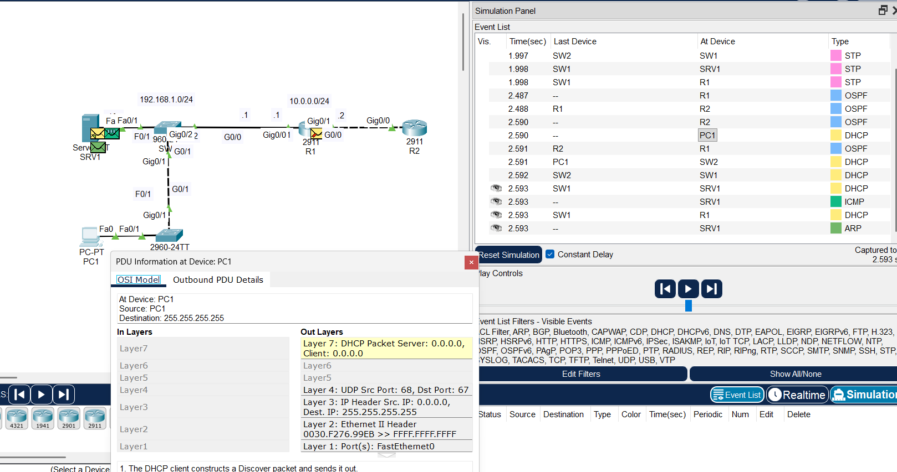

# OSI Model – Packet Tracer Simulation

## Objective

Understand how network communication can be analyzed through the different layers of the OSI model using Cisco Packet Tracer.

## Topology

The lab uses a preconfigured network topology to observe the protocols and technologies involved in network communication.



## OSI Layer Analysis

| OSI Layer | Protocol / Technology | Role |
|---|---|---|
| Layer 7 – Application | DHCP | IP configuration |
| Layer 4 – Transport | UDP | Transport of DHCP messages |
| Layer 3 – Network | IPv4 | Logical addressing |
| Layer 2 – Data Link | Ethernet | Frame delivery |
| Layer 1 – Physical | Ethernet | Transmission |

## Simulation

Packet Tracer Simulation Mode was used to inspect the PDUs exchanged through the network.



## Key Observation

The simulation demonstrates the DHCP address assignment process through a DHCP release and renewal operation.

The client first releases its current IP configuration using:
```
ipconfig /release
```
It then requests a new IP configuration using:
```
ipconfig /renew
```

During this process, DHCP messages are exchanged between the client and the DHCP server. The simulation allows the encapsulation of these messages to be observed across the network stack:

- **Application Layer:** DHCP
- **Transport Layer:** UDP
- **Network Layer:** IPv4
- **Data Link Layer:** Ethernet

This illustrates how data is encapsulated as it moves down the OSI model and decapsulated when received by the destination.

The simulation also shows the role of DHCP in dynamically assigning IP configuration parameters to the client.

## Skills

- OSI Model
- Encapsulation
- Decapsulation
- Cisco Packet Tracer
