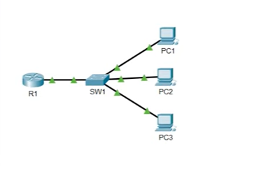

# Basic Device Security

## Objective

Configure basic security settings on Cisco network devices using the Command-Line Interface (CLI).

This lab introduces basic device identification, privileged EXEC mode protection, password encryption, and configuration persistence.

## Topology

The lab uses a simple network topology composed of Cisco routers.



## Lab Steps

### Step 1 – Configure the hostname

The hostname is configured from global configuration mode using the `hostname` command.

```
Router(config)# hostname R1
R1(config)#
```

### Step 2 – Configure an enable password
An enable password is configured using:
```
R1(config)# enable password cisco
```
This password provides basic protection for entering privileged EXEC mode with the enable command.

### Step 3 – Display the running configuration

The current device configuration can be examined using:
```
R1# show running-config
```
or the abbreviated command:
```
R1# show run
```
The running configuration contains the commands currently active on the device and is stored in RAM.

At this stage, the enable password can be observed in the configuration in clear text.

### Step 4 – Enable password encryption

Password encryption is enabled from global configuration mode using:
```
R1(config)# service password-encryption
```
This command prevents configured passwords from being displayed in clear text in the configuration.

The previously configured enable password is then stored using Cisco's Type 7 password obfuscation mechanism.

Note: service password-encryption provides weak, reversible obfuscation. It should not be considered equivalent to a secure password-hashing mechanism.

### Step 5 – Configure an enable secret

A more secure privileged EXEC password can be configured using:
```
R1(config)# enable secret class
```
The enable secret takes precedence over the enable password.

Therefore, when both are configured, the enable secret is used to authenticate access to privileged EXEC mode.

### Step 6 – Save the configuration

The running configuration is stored in RAM. To preserve the configuration after a device restart, it must be copied to the startup configuration stored in NVRAM.

The configuration can be saved using:
```
R1# write
```
or:
```
R1# write memory
```
or:
```
R1# copy running-config startup-config
```
The copy running-config startup-config command explicitly copies the current running configuration to the startup configuration.

## Key Observations

This lab demonstrates basic security mechanisms available on Cisco devices through the CLI.

The lab also demonstrates the importance of understanding how Cisco IOS stores and protects credentials rather than relying only on the presence of a password.

## Verification

The following commands can be used to verify the configuration:
```
show running-config
show startup-config
```

## Skills
- Cisco IOS CLI
- Global Configuration Mode
- Privileged EXEC Mode
- Hostname Configuration
- Enable Password
- Enable Secret
- Password Encryption
- Running Configuration
- Startup Configuration
- Configuration Persistence
