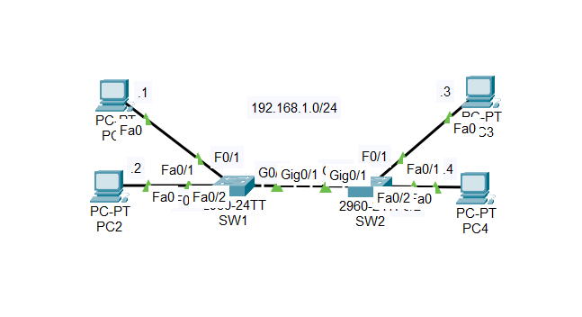

# Ethernet Switching

## Objective

The objective of this lab is to understand how Ethernet switches **learn MAC addresses and forward frames**, and how **ARP** enables communication between devices on the same local network.

The lab demonstrates the complete process of a successful `ping` from PC1 to PC3, starting with empty ARP and MAC address tables.

---

## Topology



The topology consists of:

* 4 PCs: PC1, PC2, PC3, and PC4
* 2 Ethernet switches: SW1 and SW2
* A single local network: `192.168.1.0/24`

Initial addressing:

| Device | IP Address  | MAC Address |
| ------ | ----------- | ----------- |
| PC1    | 192.168.1.1 | MAC-PC1     |
| PC2    | 192.168.1.2 | MAC-PC2     |
| PC3    | 192.168.1.3 | MAC-PC3     |
| PC4    | 192.168.1.4 | MAC-PC4     |

At the beginning of the simulation:

* All PC ARP tables are empty.
* SW1's MAC address table is empty.
* SW2's MAC address table is empty.

## Lab Steps

### Step 1 — PC1 Initiates the Ping

PC1 executes:

```text
PC1> ping 192.168.1.3
```

PC1 knows the destination IP address:

```text
Destination IP = 192.168.1.3
```

However, to send the packet over Ethernet, PC1 also needs the destination MAC address: Since this mapping **is not present in PC1's ARP table**, PC1 initiates an **ARP Request**.

### Step 2 — PC1 Sends an ARP Request

PC1 creates an Ethernet frame containing an ARP Request.

```text
Source MAC      = MAC-PC1
Destination MAC = FF:FF:FF:FF:FF:FF
```

The destination is the Ethernet **broadcast MAC address**.

The ARP message contains:

```text
Sender IP       = 192.168.1.1
Sender MAC      = MAC-PC1

Target IP       = 192.168.1.3
Target MAC      = Unknown
```

The request essentially asks:

> "Who has IP address 192.168.1.3? Reply to 192.168.1.1."

Because the destination MAC address is a broadcast address, the frame must be flooded through the local broadcast domain.

### Step 3 — SW1 Learns PC1's MAC Address

SW1 receives the ARP Request from PC1. The switch examines the **source MAC address**:

SW1 therefore learns:

```text
MAC-PC1 → Fa0/1
```

This illustrates a fundamental switching principle:

> **A switch learns MAC addresses by examining the source MAC address of incoming frames.**

Because the destination is:

```text
FF:FF:FF:FF:FF:FF
```

SW1 treats the frame as a broadcast and floods it through the other ports in the same broadcast domain. The frame is forwarded toward SW2.

### Step 4 — SW2 Learns PC1's MAC Address

SW2 receives the broadcast ARP Request. It also learns the source MAC address:

```text
MAC-PC1 → G0/1
```

Since the frame is a broadcast, SW2 floods it through its other ports. The ARP Request reaches:

* PC2
* PC3
* PC4

### Step 5 — PC2 and PC4 Ignore the Request

PC2 and PC4 examine the ARP Request:

```text
Target IP = 192.168.1.3
```

Since `192.168.1.3` does not belong to either device, they ignore the request and do not respond.

### Step 6 — PC3 Sends an ARP Reply

PC3 has:

```text
IP Address = 192.168.1.3
```

It therefore recognizes itself as the target of the ARP Request. PC3 sends an **ARP Reply** back to PC1.

Unlike the ARP Request, the ARP Reply is **unicast**, because PC3 now knows PC1's MAC address.

The ARP message contains:

```text
Sender IP       = 192.168.1.3
Sender MAC      = MAC-PC3

Target IP       = 192.168.1.1
Target MAC      = MAC-PC1
```

PC3 is essentially informing PC1:

> "192.168.1.3 corresponds to MAC-PC3."

### Step 7 — The Switches Forward the ARP Reply

The ARP Reply reaches SW2. SW2 learns PC3's MAC address:

Because SW2 already knows where `MAC-PC1` is located, it can forward the frame directly toward PC1.

The frame reaches SW1, which also learns PC3's MAC address:

SW1 then forwards the frame to PC1.

At this point, both switches have learned the MAC addresses of PC1 and PC3.

### Step 8 — PC1 Updates Its ARP Table

PC1 receives the ARP Reply and stores the IP-to-MAC mapping:

```text
192.168.1.3 → MAC-PC3
```

PC1's ARP table is now:

```text
IP Address       MAC Address
192.168.1.3      MAC-PC3
```

PC1 can now send the **ICMP packet** to PC3.

### Step 9 — PC1 Sends the ICMP Echo Request

PC1 sends the actual ICMP Echo Request. This time, the Ethernet frame is **unicast**:

```text
Ethernet
Source MAC      = MAC-PC1
Destination MAC = MAC-PC3

IPv4
Source IP       = 192.168.1.1
Destination IP  = 192.168.1.3

ICMP
Type            = Echo Request
```

The switches use their MAC address tables to determine the appropriate outgoing port. No broadcast is required.

### Step 10 — PC3 Sends the ICMP Echo Reply

PC3 receives the Echo Request and sends an ICMP Echo Reply:

```text
Ethernet
Source MAC      = MAC-PC3
Destination MAC = MAC-PC1

IPv4
Source IP       = 192.168.1.3
Destination IP  = 192.168.1.1

ICMP
Type            = Echo Reply
```

The reply is also unicast.

The ping is successfully completed.

---

## Key Observations

### 1. MAC Address Learning

Switches learn MAC addresses from the **source MAC address** of incoming frames.

### 2. Broadcast vs Unicast

The lab demonstrates two different forwarding behaviors:

| Frame             | Destination   | Behavior |
| ----------------- | ------------- | -------- |
| ARP Request       | Broadcast MAC | Flooded  |
| ARP Reply         | PC1's MAC     | Unicast  |
| ICMP Echo Request | PC3's MAC     | Unicast  |
| ICMP Echo Reply   | PC1's MAC     | Unicast  |

### 3. ARP Resolution Comes Before ICMP

PC1 cannot send the ICMP Echo Request over Ethernet until it knows PC3's MAC address.

The sequence is therefore:

```text
ARP Request
     ↓
ARP Reply
     ↓
MAC address resolution
     ↓
ICMP Echo Request
     ↓
ICMP Echo Reply
```

### 4. Switches Build Their MAC Tables Dynamically

The MAC address tables are initially empty. They are progressively populated as frames traverse the switches.

### 5. Known Unicast Forwarding

Once the switches know the destination MAC address and its associated port, they can forward unicast frames directly instead of flooding them.

## Skills

After completing this lab, you should be able to:

* Explain how **Ethernet switches learn MAC addresses**.
* Understand how a switch uses its **MAC address table** to forward frames.
* Explain the difference between **broadcast and unicast Ethernet frames**.
* Describe the **ARP request/reply process**.
* Understand how ARP enables communication between IPv4 and Ethernet.
* Trace the path of an **ICMP Echo Request and Echo Reply** through multiple switches.
* Analyze the interaction between **ARP, Ethernet switching, and ICMP** in a local network.

