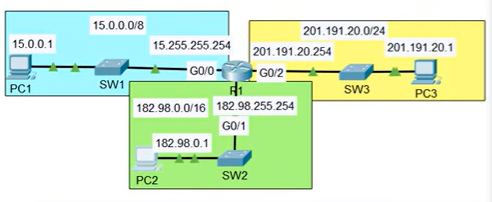
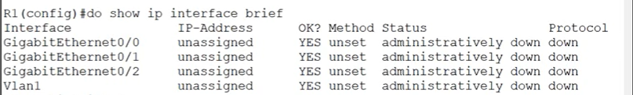
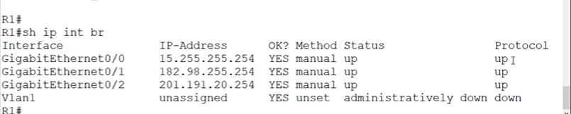
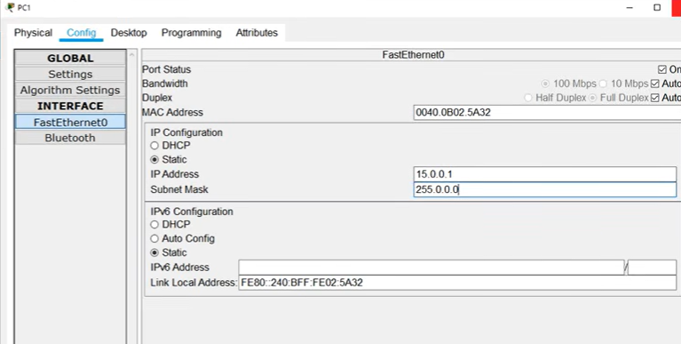

# Configuring IP Addresses

## Objective

The objective of this lab is to practice configuring IPv4 addresses on router interfaces and verify the configuration using Cisco IOS commands.

The lab also demonstrates how configuring the correct IP addresses and enabling router interfaces allows end devices to communicate across different networks.

## Topology



The topology is preconfigured and consists of:

* PCs connected to the network
* Routers with their interfaces initially unconfigured
* Multiple IP networks connected through the routers

The IP addressing scheme is provided in the topology.

## Lab Steps

### Step 1 — Configure the Router Hostname

Access the router CLI and enter privileged EXEC mode:

```text
Router> enable
```
Enter global configuration mode:

```text
Router# configure terminal
```
Configure the hostname:

```text
Router(config)# hostname R1
```
The prompt changes to:

```text
R1(config)#
```

This confirms that the router has been renamed to `R1`.

### Step 2 — Check the Router Interfaces

Before configuring the interfaces, use:

```text
R1# show ip interface brief
```

The command displays a summary of the router's interfaces, including their IP addresses and status.

At this stage, the interfaces do not have IP addresses configured.

A typical output may look like:



This allows us to verify the initial state of the router interfaces.

### Step 3 — Configure the IP Addresses

Configure each router interface according to the IP addressing scheme provided in the topology.

For example, to configure `GigabitEthernet0/0`:

```text
R1# configure terminal
R1(config)# interface GigabitEthernet0/0
R1(config-if)# ip address 15.255.255.254 255.0.0.0
R1(config-if)# no shutdown
```
The `no shutdown` command enables the interface.

Repeat the same process for the other required interfaces:

```text
R1(config)# interface GigabitEthernet0/1
R1(config-if)# ip address 182.198.255.254 255.255.0.0
R1(config-if)# no shutdown
```

The exact IP addresses and subnet masks must match the addressing scheme shown in the topology.

### Step 4 — Verify the Running Configuration

After configuring the interfaces, verify the router's current configuration using:

```text
R1# show running-config
```
or simply:

```text
R1# show run
```


The running configuration now contains the hostname and the configured interface parameters. This confirms that the configuration has been successfully applied.

You can also use:

```text
R1# show ip interface brief
```

to quickly verify the IP addresses and the operational status of the interfaces.

## Step 5 — Configure the PCs' IP Addresses

The PCs must also be configured with their corresponding IPv4 addresses before testing connectivity. For each PC, open:

PC → Desktop → IP Configuration

Select Static and enter the IP addressing information according to the topology.



Repeat the process for each PC in the topology.

The configuration must match the IP addressing scheme provided in the lab.

### Step 6 — Test Connectivity

Finally, test connectivity from PC1 using `ping`.

First, ping PC2:

```text
PC1> ping 182.198.0.1
```

Then, ping PC3:

```text
PC1> ping 201.191.20.1
```

The pings should be successful. This confirms that the router interfaces have been correctly configured and that the devices can communicate across the connected networks.

## Key Observations

### 1. Router Interfaces Are Initially Unconfigured

The `show ip interface brief` command allows us to quickly identify interfaces without IP addresses and interfaces that are administratively down.

### 2. `no shutdown` Enables an Interface

Configuring an IP address alone is not sufficient if the interface is administratively down.

The command:

```text
no shutdown
```

enables the interface.

### 3. `show running-config` Displays the Active Configuration

The `show running-config` command displays the configuration currently active in the router's RAM.

It allows us to verify that the hostname, IP addresses, subnet masks, and interface settings have been correctly configured.

### 4. IP Addressing Enables Inter-Network Communication

Once the router interfaces have valid IP addresses and are operational, the router can provide connectivity between the different networks.

The successful ping tests from PC1 to PC2 and PC3 confirm that the configuration is working correctly.

---

## Skills

After completing this lab, you should be able to:

* Use `show ip interface brief` to inspect interface status and IP addressing.
* Configure **IPv4 addresses and subnet masks** on router interfaces.
* Enable router interfaces using `no shutdown`.
* Verify the active configuration using `show running-config`.
* Test network connectivity using `ping`.
* Understand the relationship between **IP addressing, router interfaces, and network connectivity**.

